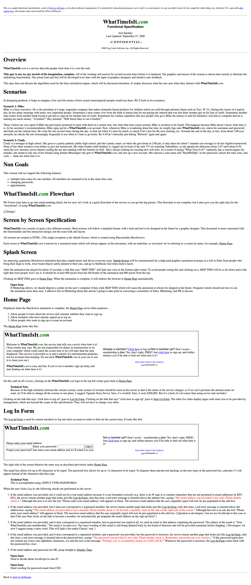
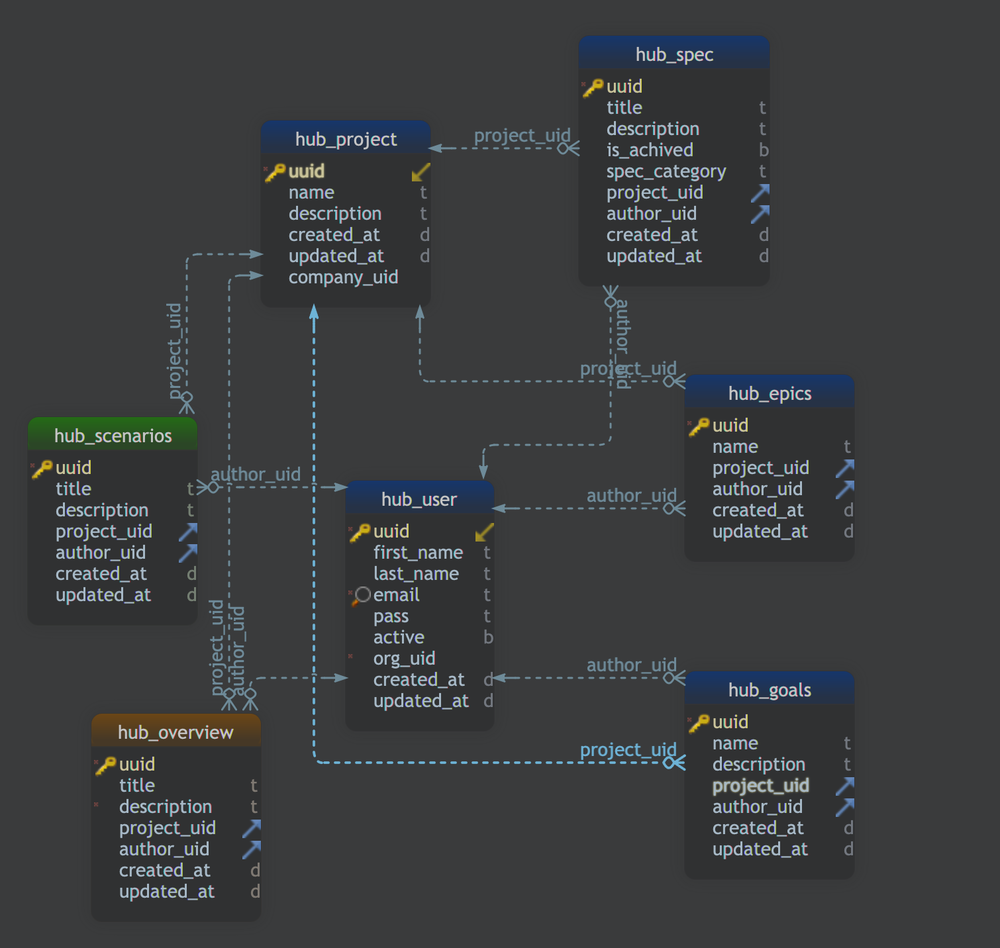
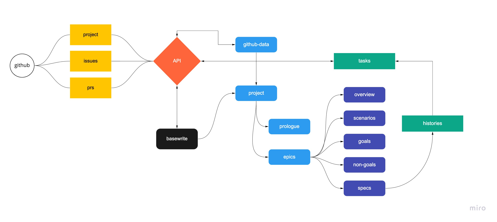

# BASEWRITE

O propósito do basewrite a ser uma aplicação github para complementar a área de documentação/especificação com todas  as ligações possiveis no desenho, explicação, desempenho e timeline de um produto. A main feature será depois de ter todas as concepções descritas se possa ler como um livro e exportar essa especificação para pdf.

As permissas que devem constar poderão ser a simplicidade de produzis uma especificação e perceber o seu intuituito, tarefas que foram agregadas, issues que foram associadas ao seu desenvolvimento, intervenientes e registos de commits etc. Até com a diferenciação de timimg sobre os commits poderá dar uma relatório mais macro sobre tempo de desenvolvimento envolvido.

No nivel de intereção do user quando descreve cada um dos épicos com os devidos cenários seria ter algo parecido com que o medium faz quando queremos comentar aréas de texto para poder transformar em tarefas no projecto do github.

## Bases e inspirações

Para se perceber melhor o intuito da ferramenta este grupo de artigos explicam perfeitamente o próposito da aplicação, sugiro que leiam para perceberem a solução e problemática envolvida:

- https://www.joelonsoftware.com/2000/10/02/painless-functional-specifications-part-1-why-bother/
 - https://www.joelonsoftware.com/2000/10/03/painless-functional-specifications-part-2-whats-a-spec/
 - https://www.joelonsoftware.com/2000/10/04/painless-functional-specifications-part-3-but-how/
 - https://www.joelonsoftware.com/2000/10/15/painless-functional-specifications-part-4-tips/

Spec example: https://www.joelonsoftware.com/whattimeisit/ (super clean)

## Adversários

- Confluence, mas não integra nada com github.
- specfox.com, tb não integra em nada com github e o editor deles é mero WYSIWYG.

Uma janela de oportunidade sem adversários nesta ârea.

## Pretensão

Uma imagem vale por mil palavras

## Data

Entidades que poderam ser extrapuladas do exemplo acima para a criação da base de dados:

- Projecto (github)
- Descritivo (Prólogo)
- Épicos
  - Overview
  - Cenários
  - Objectivos e não objectivos
  - Especificação
    - Flow???
    - Historias (feature/screen)
    - Tarefas (to github)
  - ...github info

## Flow

O user instala aplicação no repo, para se interagir com a source code e todas as features que envolvem o repo. Do base write poder assinalar que partes da feature/screen irá criar tarefas no project do github. Todo o registo complementar de estado se encontra, se tem issues, PR e historico de commits bem como timeline de tempo de desenvolvimento deverá constar como extra management view de relatorio do épico.

## Tecnologia

O uso de conceito REst, não necessáriamente multiplas bds e micro-serviços até ser uma unica db. Utilização de ferramentas já disponiveis para ajudar a rapidez de desenvolvimento nomeadamente:

- gotrue (centralized auth with audience and github integration) o meu fork com extras: https://github.com/websublime/gotrue
- gotrue-js (fe consumer): https://github.com/websublime/gotrue-js
- postgres with multiple batteries included: https://github.com/websublime/postgres
- courier: pubsub com hooks e preparado para events do postgres (realtime) bem como socket por topico: https://github.com/websublime/courier
- file server minio with auth (wrapper de minio com segurança e privacidade): https://github.com/websublime/barrel
- Hasura.io para api/graphql (superb)

Tudo isto são quase forks meus que tenho vindo a trabalhar para ajudar a construi uma infra-estrutura que dará para este e outros projectos. Courier quase finalizado e barrel também. Tudo dockers.

Linguagem de eleição para backend: golang. Frontend talvez Vue ou Angular.
