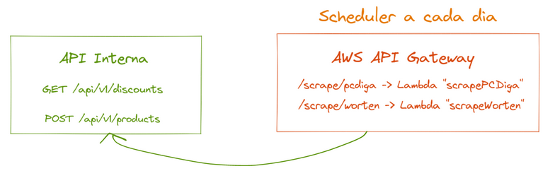

# Doutor Preço / Doctor Price
O Doutor Preço pretende recolher os preços/stock/dados de todos os produtos das mais variadas lojas (tanto nacional como internacional) e centralizar esta informação num único lugar.

Estes dados serão analisados de forma a permitir:
- Identificar marketing enganador sobre falsas promoções
- Fazer scalping de preços
- Identificar os pontos de venda mais baratos que vendem determinado produto
- Receber notificações (SMS, push e e-mail) quando preço atingir determinado valor (ponderar porque envolve guardar PII de utilizadores)
- Verificar o histórico de preço de um produto

## Componentes principais:
- API
	- Pública
		- Consulta de preços atuais
		- Consulta de histórico de preços
		- Consulta de descontos
		- Pedir para ser notificado quando preço atingir determinado valor
	- Privada
		- Inserção/atualização de novos produtos (com respetivos preços e stocks)
- Garantir que produtos que estão na base de dados ainda existem (p.ex. não foram descontinuados)
- Scripts de parse de cada loja
	- Parse de catálogo (se aplicável)
	- Parse de página de produto
- Base de dados (MySQL) - para guardar os dados relativos a lojas, produtos e evolução dos preços com o decorrer do tempo
- Tarefas periódicas que correm um algoritmo que com base nos dados da base de dados, identificam p.ex., descontos significativos e/ou descontos falsos
- Browser extension (abstrair base numa lib JS para se conseguir reutilizar relativamente facilmente numa extensão para Chrome e Firefox) - scraping distribuído ou em background ou a navegar no site de uma loja - perceber possíveis implicações e como verificar autenticidade dos dados - sistema de reputação (p.ex. tem que ter enviado resultados scrapados X resultados válidos para que sejam considerados válidos)

API ao receber produtos, receberia um input como o seguinte:
- store_product_id ?int (o id específico de cada produto em cada loja, meramente para nos ajudar a fazer mapping caso não tenhamos EAN ou o SKU)
- name text
- picture array
- description longtext
- price_incl_tax decimal(10,2)
- price_excl_tax decimal(10,2)
- categories ?array
- EAN ?string (código único universal do produto)
- SKU ?string
- in_stock ?bool (há lojas que só aparece se tem stock, não a quantidade, pode ser útil termos isto)
- available_stock ?int (total de stock disponível)

Tech Stack:
A ideia seria ter uma layer de abstração que invocaria cada script, independentemente da linguagem, permitindo uma colaboração de mais colaboradores.

A desvantagem é que pode complicar em termos de Infra - no entanto utilizando AWS Lambdas (com imagens Docker custom), damos suporte para praticamente tudo.

