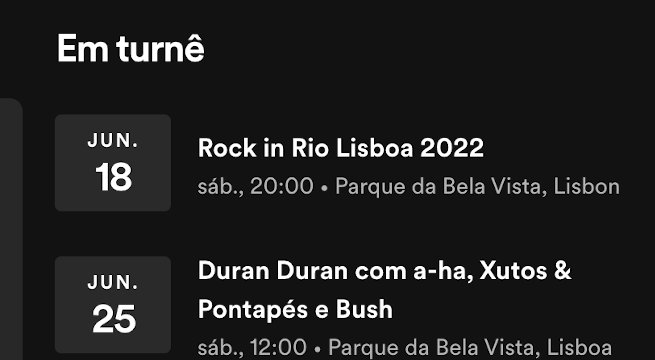
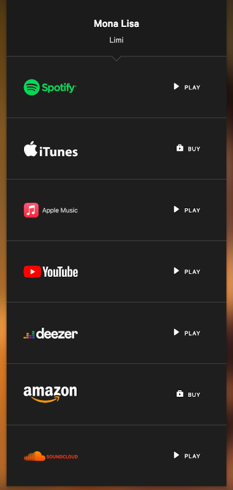

# Espetáculo

(O nome é claramente algo discutível)

## Descrição

Basicamente a ideia seria uma aplicação/web app, simples onde os artistas/bandas apontassem onde vão atuar, quando vão lançar uma nova música, e talvez ter algumas notícias do que se passa com o artista/banda.

Pensei em algo como uma rede social, onde os fãs podem seguir os artistas e sempre estar atualizados com as novidades. Os seguidores iriam receber notificações quando algum evento acontecer ou quando um novo disco/álbum/música for lançado.

Imagino que tanto dá para ser uma aplicação muito simples, onde apenas dá para seguir artistas e ver as novidades na página inicial os feed das dos artistas que segues. 
Mas também acredito que seja facilmente escalável, como, por exemplo, ter uma secção de links para as músicas publicadas. Cada artista poderia ter algo como uma página pessoal (algo tipo um blog...), imagino que na aplicação os artistas poderiam criar fórum/comunidades com os fãs, ou até os fãs criar fórum/comunidades de entre os fãs.

Mais uma ideia seria usar o Google Maps para apresentar as localizações dos eventos.

## Bases, Inspirações e Concorrência
Para ser sincero não encontrei nenhuma aplicação que preenchesse os requisitos que descrevi em cima, mas se, entretanto encontrar alguma aplicação que se encaixe minimamente nos requisitos eu volto a editar isto :)

Acredito que não seja nada de original, até porque já há várias apps que fazem mais ou menos isso como o Spotify que se abrirmos o perfil de um artista vai lá aparecer a lista de músicas, biografia e até os próximos espetaculosos, mas o que eu pensei foi algo mais ao estilo rede social, em vez de termos que ir artista por artista ver quando e onde é que vai atuar, a própria aplicação é que nos iria mandar uma notificação quando algum evento iria acontecer e onde, etc...

## Estrutura

- Página inicial (Feed): Aqui seria onde os fãs poderiam ver todas as notícias dos artistas que seguem, como os novos discos, novos eventos, etc...
- Pagina do Artista:
  - Biografia
  - Próximos espetáculos/concertos/eventos
  - Próximos discos/álbuns/musicas/etc...

## Tecnologias, Flow e Design

Imagino que para fazer uma aplicação deste género seja preciso pessoal tanto de FrontEnd como BackEnd. Eu sou apenas um júnior FE, por isso não sou bem a pessoa mais indicada para dizer isto, mas imagino que para FE poderia-se usar [React](https://reactjs.org/) :)

## Imagens Representativas

Exemplo do Spotify que inidica os proximos eventos. [Exemplo](https://open.spotify.com/artist/1lQnDEcvFAWaUjbyZiHKih);

----

Exemplo do 7clouds que ao clicar num dos icons leva para para a respectiva música na sua rede social. [Exemplo](https://7clouds.fanlink.to/MonaLisa)

## PS

Ainda me considero muito noob para conseguir fazer uma aplicação deste género. Imagino que poderia (e gostaria) de ajudar, mas sozinho não acredito que consigo 😅
