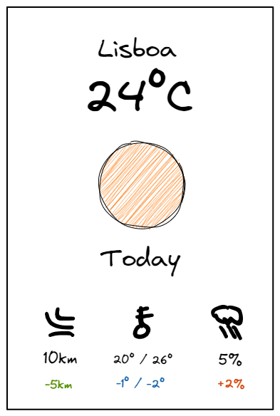
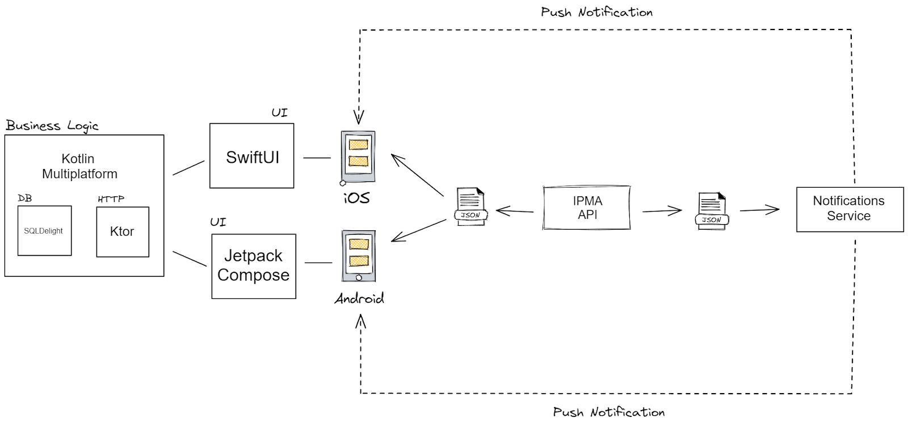

# METEOIFY

O propósito do Meteoify é providenciar ao utilizador informação meteorológica semanal e a possibilidade de comparar com dados anteriores, de forma detalhada num design apelativo.

O utilizador poderá inclusive receber notificações diárias com a diferença dos dados meteorológicos em relação ao dia anterior.

## Outros possíveis nomes
- met.io
- temposync
- meteodiff
- tempodiff

## Bases e inspirações

A aplicação deverá por base ter as seguintes funcionalidades:

- Permitir verificar a meteorologia do dia anterior
- Permitir verificar a meteorologia de toda a semana atual
- Permitir verificar a meteorologia diária por hora
- Conseguir comparar dados meteorológicos de dois dias diferentes
- Receber notificações
- Diferença do tempo do dia anterior face ao de hoje
- Temperatura
- Vento
- Precipitação
- Estado do mar
- Avisos meteorológicos

O desenho de uma possível interface deverá ter em conta os seguintes designs:
- https://www.behance.net/gallery/48448919/Free-PSD-Weather-App-Prototype
- https://dribbble.com/shots/5546848-FREE-Multifunctional-Weather-App-demo/attachments/5546848-FREE-Multifunctional-Weather-App-demo?mode=media

## Incógnitas
- Deve ser incluído o suporte para diversos países? Caso afirmativo, é necessário que se consiga um provider externo, pois o IPMA que é a API responsável pelos dados portugueses não dispõe de dados internacionais. É de ter em atenção que a larga maioria das APIs de meteorologia são pagas.
- É preciso um backend? A ideia inicial seria que as apps fizessem os pedidos diretamente à API, e guardassem numa DB Local os dados do dia anterior, de forma a se evitar custos com backend. O problema é que para uma feature de notificações, teríamos de ter um backend de qualquer forma, portanto, o mais provável é virmos a ter um backend que simplesmente comunica com a Weather API, e guarde numa cache os dados anteriores, não sendo exatamente precisa uma DB. Pode inclusive guardar em cache os dados mais recentes, pois o IPMA só é actualizado em algumas horas do dia.

## Concorrência
### Análise
TBD

### Conclusão
TBD

## Flow
O objectivo é em princípio a app não ter backend, a não ser o serviço de notificações (talvez usar um third party service como Pusher ou Firebase + cloud functions). Como não há backend, não há login/profiles, toda a informação é guardada no device, assim como a informação meteo do dia anterior (do que sabemos o IPMA não retorna dados de dias anteriores).

Talvez no futuro podemos suportar logins/profiles para as pessoas ficarem com as localizações guardadas e sincronizadas em vários devices, mas na primeira iteração da app, o objectivo é ficar tudo do lado do cliente.

O primeiro screen deverá apresentar a meteorologia do dia, daod que não existe login. Idealmente, deveria conter as informações mais importantes e eventualmente aparecer também a diferença para os dados do dia anterior.

**Exemplo wireframe do primeiro ecrã:**

No primeiro ecrã é possível ver a temperatura de hoje, a mínima, e o máximo, o vento e a probabilidade de chover, com as respectivas diferenças em relação ao dia anterior. No lado esquerdo temos o vento de hoje a 10km/h, e está -5km/hr do que ontem. No meio, a temperatura min/max, e hoje está menos calor, pois está -1º / -2º. No lado direito, há mais probabilidade de chover hoje pois subiu 2%. TBD se metemos a diferença em relação ao dia anterior, ou metemos diretamente o valor do dia anterior com uma cor diferente, exemplo: Em vez de -1º / -2º, metemos 19º / 24º. O meter a diferença pode ser menos user friendly, pois obriga o user a fazer cálculos de cabeça.

Depois, ao fazer scroll para baixo, estaria a informação da semana toda. (Wireframe TBD)

## Tecnologia
Como temos developers experientes em native mobile na equipa devPT, faz sentido fazer aplicação mobile em iOS e Android nativas. 

A ideia seria utilizar SwiftUI para iOS, e JetpackCompose para Android. São duas novas formas de fazer UI nativos que são fáceis de aprender e rápidas de implementar comparando com as tecnologias anteriores. Como somos uma equipa pequena, a ideia é partilhar tudo o que seja business logic entre as aplicações através de Kotlin Multiplatform. Assim, os pedidos HTTP, local DB, e lógica fica centrada em Kotlin Multiplatform. 

**High-level Architecture:**

Para não haver manutenção de backend, ou gastar dinheiro com cloud functions, os clientes fazem os pedidos diretamente a Weather API, e guardam localmente o dia anterior. Os Cons disto é que pode haver alguma lógica duplicada, pois o serviço de notificações também vai usar diretamente a API, e a primeira vez que os users usam a app, não têm a info do dia anterior… Este último Con pode ser um factor decisivo se temos ou não um backend… TBD.
Cons de Kotlin Multiplatform:
- Setup complexo. (Requer bons conhecimentos de Gradle + iOS Linking)
- CI/CD complexo.
Outras opções para mobile app:
- Flutter
- React Native
- iOS + SwiftUI e Android + JetpackCompose, sem Kotlin Multiplatform. A app é bastante pequena, portanto usar o Kotlin Multiplatform, e dado ao setup complexo, provavelmente não ganhamos nada em usar KMM.
Em caso de backend:
- Cloud functions + Cache. O IPMA também atualiza a informação a horas específicas, portanto, na maioria das vezes iria só buscar a cache.  

Sources
API - https://api.ipma.pt/ (grátis)
AccuWeather (pago - faz sentido?)